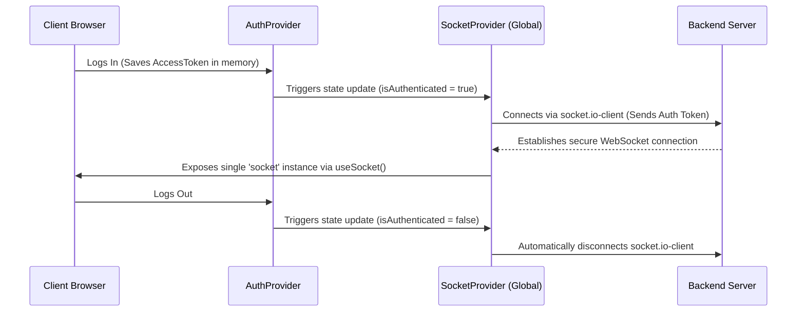

# READIZEN 📖
### *Interactive Fullstack English Reading & Mentorship Platform*

[](https://nodejs.org/)
[](https://react.dev/)
[](https://socket.io/)
[](https://www.mongodb.com/)
[](https://opensource.org/licenses/MIT)

Readizen is a premium fullstack web application designed to connect parents and young students with tailored English reading courses (Readizen Set 1, 2, 3). The platform streamlines the onboarding journey through dynamic course consultation requests, instant real-time chats with academic advisors, and a centralized management portal for administrators.

---

## 🚀 Live Demo & Screenshots

*   **Production Deployment URL:** [https://readizen.vercel.app](https://readizen.vercel.app) *(Frontend on Vercel)*
*   **Backend REST/Socket Server:** [https://readizen-backend.onrender.com](https://readizen-backend.onrender.com) *(Backend on Render)*

### Application Screenshots
| Student Portal - Real-time Chat | Admin Portal - Consults & Chats Workspace |
| :---: | :---: |
|  |  |

---

## 🌟 Core Features

### 👤 1. Secure Authentication & Role-Based Access
*   **Dual Portal Access:** Distinct routes and layout dashboards for **Students/Parents** and **Admins**.
*   **Silent Token Refresh (JWT):** Short-lived Access Tokens are stored securely in-memory, while Refresh Tokens are sent via secure, HTTP-only, cross-origin cookies.
*   **Auto-Route Protection:** Custom wrapper components redirect unauthenticated clients and block non-admin users from accessing system management panels.

### 💬 2. Real-time Mentorship Chat
*   **Persistent Global Socket Context:** A single unified Socket.io instance managed via `SocketContext` preventing connection leaks and redundant re-connections on tab switching.
*   **Targeted Rooms:** Direct user-to-admin message routing isolated by Socket.io room rooms (`userId`).
*   **Instant Read Status updates:** Live unread message badges, auto-read-receipts, and real-time previews for incoming support requests.

### 📝 3. Dynamic Course Consultation Forms
*   **Profile Integration:** Authenticated parents can instantly submit consultation requests matching their children's English proficiency levels and specific books of interest.
*   **History Logs:** Real-time history logs with progress tags (`pending`, `contacted`, `canceled`) and teacher feedback comments.

### 📊 4. High-Performance Admin Center
*   **MongoDB Aggregation Pipeline:** Optimized inbox listing using a single-query aggregation stage (`$lookup`, `$slice`, `$project`, `$sort`) resolving classic N+1 query bottlenecks.
*   **Real-time Multi-Chat Workspace:** Admin chat console equipped with real-time room switching, dynamic search filtering, and live previews.

---

## 🛠️ Tech Stack & Tools

*   **Frontend:**
    *   `ReactJS` (Vite Environment)
    *   `TailwindCSS v4` (Custom design system featuring curated palettes: `brand-green`, `brand-cream`, `brand-yellow`)
    *   `Lucide React` (Icon library)
    *   `Axios` (Interceptors configured with `withCredentials: true`)
*   **Backend:**
    *   `Node.js` & `Express.js` (RESTful API Architecture)
    *   `Socket.io` (Real-time WebSockets communication)
*   **Database:**
    *   `MongoDB` & `Mongoose` (Schemas configured with optimized indexes on Foreign Keys)
*   **DevOps & Hosting:**
    *   **Vercel:** Optimized SPA deployment utilizing custom rewrite rules (`vercel.json`)
    *   **Render:** Automated cloud web service builds with environment variables mapping
    *   **MongoDB Atlas:** Global database hosting with custom network whitelist controls

---

## 📐 Architecture & System Design

### 1. Unified Socket.io Connection Lifecycle
Instead of establishing socket connections inside components (which creates redundant connections whenever components render), Readizen manages the socket globally:


### 2. High-Performance Aggregation (N+1 Query Fix)
In the admin chat list, retrieving the last message for each user using individual queries creates an `O(N)` load. Readizen resolves this in `O(1)` database roundtrip:
```javascript
// A single high-performance pipeline replaces loops on the backend
const chatList = await User.aggregate([
    {
        $lookup: {
            from: "messages",
            localField: "_id",
            foreignField: "userId",
            as: "allMessages"
        }
    },
    {
        $project: {
            userId: "$_id",
            userName: "$fullName",
            email: "$email",
            avatarUrl: "$avatarUrl",
            lastMessageObj: { $arrayElemAt: [{ $slice: ["$allMessages", -1] }, 0] }
        }
    },
    { $sort: { "lastMessageObj.createdAt": -1 } }
]);
```

---

## 📂 Project Structure

```text
readizen/
├── backend/
│   ├── src/
│   │   ├── controllers/      # Route controllers (auth, chat, forms)
│   │   ├── lib/              # DB connections and helpers
│   │   ├── models/           # Mongoose schemas with indexed foreign keys
│   │   ├── middlewares/      # JWT authentication and CORS guards
│   │   ├── routes/           # REST API endpoints
│   │   └── server.js         # Entry point (Express + WebSockets Server)
│   ├── .env.example          # Sample environment variables
│   └── package.json
├── frontend/
│   ├── src/
│   │   ├── components/       # Shared UI (Header, ProtectedRoute, AdminRoute)
│   │   ├── context/          # Global Context (AuthContext, SocketContext)
│   │   ├── pages/            # Page Views (Learn, Practice, Profile, Admin)
│   │   ├── services/         # Axios instance and API connections
│   │   ├── index.css         # Custom Tailwind v4 styling variables
│   │   └── main.jsx          # Providers wrapper setup
│   ├── vercel.json           # Vercel SPA routing redirects configuration
│   └── package.json
└── README.md
```

---

## ⚙️ Getting Started

### 1. Prerequisites
*   Node.js (v18+)
*   npm or yarn
*   A MongoDB connection string (local or MongoDB Atlas)

### 2. Installation
Clone the repository and install dependencies in both folders:

```bash
# Clone the repository
git clone https://github.com/duykhanh-tran/readizen.git
cd readizen

# Install backend dependencies
cd backend
npm install

# Install frontend dependencies
cd ../frontend
npm install
```

### 3. Environment Variables Configuration

Create a `.env` file in the **backend** folder:
```env
PORT=5000
MONGODB_CONNECTIONSTRING=your_mongodb_connection_string
JWT_SECRET=your_jwt_access_token_secret
REFRESH_TOKEN_SECRET=your_jwt_refresh_token_secret
ADMIN_DEFAULT_PASSWORD=adminpassword123
ALLOWED_ORIGIN=http://localhost:5173
```

### 4. Running the Application locally

```bash
# Run backend (from /backend folder)
npm run dev

# Run frontend (from /frontend folder in a new terminal)
npm run dev
```
Open [http://localhost:5173](http://localhost:5173) in your browser.

---

## 📊 API Reference

### Authentication Endpoints
| Method | Endpoint | Description | Access |
| :--- | :--- | :--- | :--- |
| `POST` | `/api/auth/register` | Registers a new user account | Public |
| `POST` | `/api/auth/login` | Authenticates user & sets refresh cookie | Public |
| `POST` | `/api/auth/admin-login` | Authenticates administrator | Public |
| `POST` | `/api/auth/refresh` | Regenerates short-lived Access Token | Public |
| `POST` | `/api/auth/logout` | Clears refresh tokens and cookies | Public |
| `GET` | `/api/auth/me` | Fetches current user profile | Private |

### Chat Endpoints
| Method | Endpoint | Description | Access |
| :--- | :--- | :--- | :--- |
| `GET` | `/api/chat` | Fetches chat messages for the logged-in student | Client |
| `PUT` | `/api/chat/read` | Marks client's chat messages as read | Client |
| `GET` | `/api/chat/users` | Lists all chat rooms with message previews | Admin |
| `GET` | `/api/chat/:userId` | Fetches chat history with a specific student | Admin |
| `PUT` | `/api/chat/:userId/read`| Marks chat messages from a user as read | Admin |

---

## 🗺️ Product Roadmap

- [ ] **AI Placement Test:** Integrate OpenAI API to suggest reading books automatically based on audio recordings of kids speaking.
- [ ] **Real-time Notifications:** Support web push notifications for incoming chat messages when the application is in the background.
- [ ] **Interactive E-Book Reader:** Embed interactive reading worksheets and reading progress tracking directly inside the dashboard.

---

## ✍️ Author & Contact

*   **Developer:** Duy Khanh Tran
*   **GitHub:** [duykhanh-tran](https://github.com/duykhanh-tran)

*   **LinkedIn:** [Your LinkedIn Profile](https://linkedin.com)
*   **Email:** [duytran2005@gmail.com](mailto:duytran2005@gmail.com)

*Feel free to star 🌟 the repository if you find this project helpful!*
