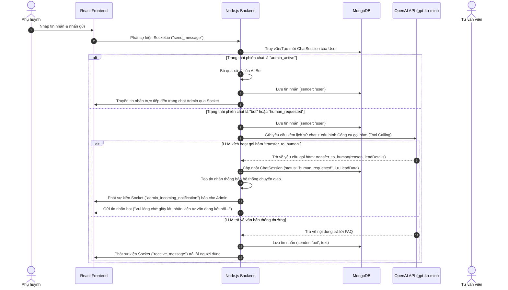

# Tài liệu Thiết kế Hệ thống & Lộ trình Triển khai: Nâng cấp Chat Hỗ trợ AI-First tích hợp Chuyển giao Người thật (Human-Handoff)

Tài liệu này chi tiết hóa kế hoạch kiến trúc để nâng cấp hệ thống bong bóng chat hỗ trợ khách hàng hiện tại (sử dụng MERN stack + Socket.io) của nền tảng **Readizen** thành một hệ thống lai thông minh. Mục tiêu là cung cấp phản hồi AI tức thì (Pha 1), thu thập thông tin khách hàng tiềm năng (Pha 2), kích hoạt chuyển giao cho tư vấn viên (Pha 3), và gửi thông báo thời gian thực đến Admin qua hạ tầng Socket.io có sẵn (Pha 4) với chi phí vận hành tối thiểu.

---

## 1. Đánh giá Hệ thống Hiện tại & Lỗ hổng Kiến trúc

Qua việc kiểm tra mã nguồn chat hiện tại, chúng tôi nhận thấy:
*   **Chưa có cơ chế theo dõi Trạng thái cuộc hội thoại**: Hiện tại, các tin nhắn được lưu trữ phẳng trong model `Message` và chỉ liên kết với `userId`. Chưa có mô hình `ChatSession` hay `Conversation` để xác định cuộc hội thoại này đang được xử lý bởi Bot AI hay đã chuyển giao cho Admin.
*   **Lưu trữ Tin nhắn phẳng**: Schema `Message` hiện tại chỉ lưu `userId`, `sender` (`'user' | 'admin'`), `text`, và `isRead`.
*   **Hạ tầng Socket.io truyền thẳng**: Hiện tại, khi người dùng gửi tin nhắn, hệ thống sẽ phát trực tiếp (broadcast) vào phòng chat của User:
    ```javascript
    socket.on('send_message', async (data) => { ... io.to(userId).emit('receive_message', newMessage); });
    ```
    Luồng này thiếu một bộ định tuyến trung gian (router) để quyết định xem tin nhắn nên được chuyển cho LLM xử lý hay chuyển trực tiếp cho Admin.

---

## A. Đề xuất Công nghệ & Chiến lược AI

Để đạt được độ trễ thấp và tối ưu hóa chi phí vận hành, chúng tôi đề xuất ngăn xếp công nghệ gọn nhẹ sau:

### 1. Lựa chọn Mô hình Ngôn ngữ lớn (LLM)
*   **Đề xuất**: **OpenAI `gpt-4o-mini`** (hoặc **Gemini 1.5 Flash**).
*   **Lý do**:
    *   **Hiệu quả chi phí**: `gpt-4o-mini` có giá cực kỳ rẻ ($0.15 / 1 triệu token đầu vào, $0.60 / 1 triệu token đầu ra).
    *   **Tốc độ**: Độ trễ phản hồi trung bình dưới 1.5 giây, lý tưởng cho trải nghiệm chat tương tác trực tiếp.
    *   **Function/Tool Calling**: Khả năng gọi hàm có cấu trúc cực kỳ chính xác và ổn định, đóng vai trò then chốt trong việc trích xuất thông tin Lead và kích hoạt chuyển giao cuộc gọi.

### 2. Thư viện Tích hợp
*   **Đề xuất**: Sử dụng trực tiếp **SDK chính thức `openai`** hoặc **`@google/generative-ai`** cho Node.js.
*   **Lý do**: Các framework trung gian như LangChain hay Vercel AI SDK sẽ tạo thêm các lớp trừu tượng không cần thiết, làm tăng kích thước package và tăng thời gian khởi động lạnh (cold start) trong ứng dụng Express/Socket.io. Việc gọi trực tiếp SDK giúp giữ mã nguồn tinh gọn và hiệu năng cao nhất.

### 3. Phương pháp Cung cấp Cơ sở Tri thức (Knowledge Base)
*   **Phương pháp**: **FAQ Memory lưu trữ trực tiếp trong bộ nhớ hệ thống (In-Memory Semantic Cache)**.
*   **Lý do**:
    *   Vì các thông tin FAQ của nền tảng giáo dục Readizen (học phí, khóa học, tài khoản, kỹ thuật) mang tính cố định và dung lượng nhỏ (dưới 15KB văn bản), việc cài đặt Cơ sở dữ liệu Vector (như Pinecone/Milvus) là không cần thiết và tốn kém chi phí duy trì.
    *   Thay vào đó, cơ sở tri thức FAQ sẽ được định dạng cấu trúc JSON và nạp trực tiếp vào **System Prompt** của LLM. Phương pháp này đảm bảo **độ trễ tìm kiếm tri thức bằng 0ms** và **không phát sinh thêm chi phí cơ sở dữ liệu**.

---

## B. Nâng cấp Cơ sở dữ liệu (Mongoose Schema)

Chúng tôi sẽ tạo một model độc lập là `ChatSession` thay vì ghi đè lên model `User` để đảm bảo tách biệt dữ liệu phiên chat.

### 1. Model mới: `ChatSession.js`
Model này theo dõi trạng thái của phiên chat, thông tin tư vấn viên tiếp nhận, và dữ liệu khách hàng tiềm năng do AI thu thập được.

```javascript
import mongoose from 'mongoose';

const chatSessionSchema = new mongoose.Schema({
    userId: {
        type: mongoose.Schema.Types.ObjectId,
        ref: 'User',
        required: true,
        unique: true
    },
    status: {
        type: String,
        enum: ['bot', 'human_requested', 'admin_active'],
        default: 'bot',
        index: true
    },
    leadData: {
        parentName: { type: String, default: '' },
        phone: { type: String, default: '' },
        childAge: { type: Number, default: null },
        notes: { type: String, default: '' }
    },
    assignedAdminId: {
        type: mongoose.Schema.Types.ObjectId,
        ref: 'Admin',
        default: null
    },
    handoffReason: { type: String, default: '' },
    lastActiveAt: { type: Date, default: Date.now }
}, { timestamps: true });

const ChatSession = mongoose.model('ChatSession', chatSessionSchema);
export default ChatSession;
```

### 2. Cập nhật Schema `Message.js` hiện tại
Bổ sung thêm giá trị `'bot'` vào enum `sender` để phân biệt tin nhắn của AI với tin nhắn của tư vấn viên:
```javascript
sender: {
    type: String,
    required: true,
    enum: ['user', 'admin', 'bot']
}
```

---

## C. Kiến trúc Hệ thống & Luồng Dữ liệu (Logic)



### 1. Cơ chế kích hoạt Chuyển giao (Tool Calling)
Chúng tôi cung cấp một mô tả công cụ `transfer_to_human` cho API OpenAI. Prompt hệ thống sẽ hướng dẫn AI tự động kích hoạt công cụ này khi:
*   Người dùng yêu cầu gặp tư vấn viên (ví dụ: *"gặp nhân viên"*, *"nói chuyện với người"*).
*   Câu hỏi của người dùng quá phức tạp hoặc nằm ngoài phạm vi tri thức FAQ mẫu.
*   Phát hiện cảm xúc tiêu cực, giận dữ từ phía người dùng.
*   AI đã thu thập đầy đủ thông tin Lead (tên, số điện thoại, tuổi của con) và người dùng muốn đăng ký khóa học cụ thể.

#### Cấu trúc định nghĩa Tool:
```javascript
const tools = [
    {
        type: "function",
        function: {
            name: "transfer_to_human",
            description: "Chuyển cuộc trò chuyện sang nhân viên tư vấn khi cần thiết hoặc khi đã thu thập đủ thông tin khách hàng.",
            parameters: {
                type: "object",
                properties: {
                    reason: { type: "string", description: "Lý do chuyển giao cuộc gọi" },
                    extractedLeadInfo: {
                        type: "object",
                        properties: {
                            parentName: { type: "string" },
                            phone: { type: "string" },
                            childAge: { type: "number" }
                        }
                    }
                },
                required: ["reason"]
            }
        }
    }
];
```

---

## D. Lộ trình Triển khai Phân kỳ

Để đảm bảo hệ thống vận hành an toàn, chúng tôi phân chia công việc thành 4 giai đoạn cụ thể:

### Pha 1: Tích hợp Database & Thiết lập Logic AI
*   Viết file Schema Mongoose `ChatSession.js` và đăng ký vào luồng dữ liệu.
*   Cài đặt module giao tiếp với AI (`aiService.js`) sử dụng SDK `openai`.
*   Thiết lập file cấu trúc JSON FAQ tri thức nền tảng và viết System Prompt điều phối.
*   Định nghĩa cấu trúc schema của tool `transfer_to_human`.

### Pha 2: Bộ định tuyến Socket & Phản hồi Tự động
*   Tái cấu trúc lại trình lắng nghe sự kiện `send_message` của Socket.io trong `server.js`.
*   Tích hợp bộ định tuyến kiểm tra trạng thái `ChatSession.status`.
*   Xử lý bất đồng bộ khi LLM gọi hàm (lưu thông tin Lead thu thập được và đổi trạng thái chat sang `human_requested`).
*   Định dạng và gửi phản hồi tự động của bot về lại phía Client ngay lập tức.

### Pha 3: Giao diện Admin & Tiếp nhận cuộc gọi thời gian thực
*   Cập nhật giao diện chat của Admin (`frontend/src/pages/admin/Chat.jsx`) để đăng ký lắng nghe sự kiện `admin_incoming_notification`.
*   Hiển thị thông báo nhấp nháy, âm thanh chuông báo khi có phiên cần chuyển giao.
*   Tạo nút **"Tiếp nhận cuộc gọi"** cho Admin, khi bấm sẽ đổi trạng thái session sang `admin_active` và gán ID tư vấn viên phụ trách.

### Pha 4: Kiểm thử, Tối ưu hóa Prompt & Đóng gói
*   Tinh chỉnh Prompt để AI thu thập thông tin khách hàng một cách tự nhiên như trò chuyện thân mật, tránh cảm giác điều tra thông tin.
*   Xử lý các trường hợp biên như người dùng tắt/mở lại bong bóng chat.
*   Xác minh các tài khoản ẩn danh đăng ký qua điện thoại thừa hưởng đầy đủ lịch sử hội thoại khi chuyển giao thành công cho tư vấn viên.
