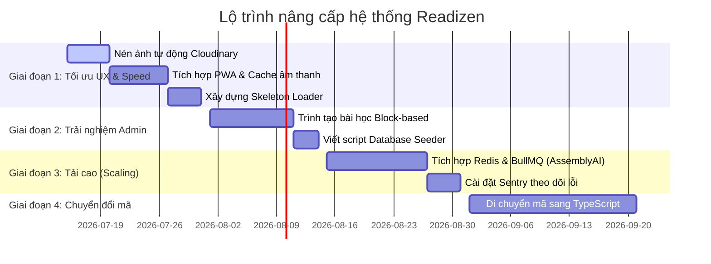

# KẾ HOẠCH NÂNG CẤP HỆ THỐNG TOÀN DIỆN (READIZEN SYSTEM UPGRADE ROADMAP)

Bản kế hoạch này đóng vai trò là khung xương sống (backbone) kỹ thuật để định hướng nâng cấp dự án **Readizen** lên tiêu chuẩn vận hành Enterprise ổn định, bảo mật cao và chịu tải lớn.

---

## 📋 TỔNG QUAN LỘ TRÌNH TRIỂN KHAI (ROADMAP OVERVIEW)



---

## GIAI ĐOẠN 1: TỐI ƯU HÓA TRẢI NGHIỆM & TỐC ĐỘ (UX & PERFORMANCE)
* **Mục tiêu**: Giảm thiểu thời gian tải trang xuống dưới 1.5 giây, tiết kiệm băng thông di động cho học sinh.

### 1.1 Tối ưu hóa Ảnh động thông qua Cloudinary
* **Nhiệm vụ**: Thay thế các link ảnh tĩnh thô bằng các link động tích hợp tham số tối ưu hóa của Cloudinary.
* **Chi tiết kỹ thuật**:
  - Viết lại hàm helper `formatCloudinaryUrl(url, width, height)` nhận đầu vào là link ảnh thô từ database, tự động phân tích và chèn các cờ:
    * `f_auto`: Chọn định dạng ảnh tốt nhất trình duyệt hỗ trợ (WebP cho Chrome/Safari, AVIF nếu có thể).
    * `q_auto`: Nén giảm dung lượng nhưng giữ nguyên độ nét hiển thị.
    * `c_fill,g_center`: Cắt ảnh chính xác theo khung lưới UI mà không méo ảnh.
  - Áp dụng helper này vào component `SafeImage.jsx` và tất cả các thẻ hiển thị ảnh bìa bài học (`coverImage`), ảnh bảng chữ cái (`thumbnail`).

### 1.2 Triển khai Cache cục bộ (Service Worker / PWA)
* **Nhiệm vụ**: Cấu hình lưu trữ offline cho các tài nguyên tĩnh nặng (Audio, Icon, Font).
* **Chi tiết kỹ thuật**:
  - Cài đặt `@vite-pwa/plugin` trên frontend.
  - Cấu hình file `vite.config.js` bật chế độ `injectRegister: 'auto'` và tạo tệp cấu hình service worker lưu cache (Precache) các tệp tin âm thanh phát âm chuẩn hệ thống, hình ảnh giao diện chính.
  - Học viên khi học lần thứ 2 sẽ không cần tốn băng thông tải lại các tệp này, giảm độ trễ khi chuyển đổi giữa các câu đọc mẫu từ 1-2 giây xuống còn **0 mili-giây (tức thì)**.

### 1.3 Xây dựng Skeleton Loader đồng bộ
* **Nhiệm vụ**: Loại bỏ trạng thái chờ "màn hình trống" gây cảm giác ứng dụng bị đơ.
* **Chi tiết kỹ thuật**:
  - Tạo component `SkeletonCard.jsx` và `SkeletonLesson.jsx` sử dụng lớp tiện ích nhấp nháy của Tailwind (`animate-pulse`).
  - Gắn vào các trạng thái `isLoading === true` trong lúc đợi API trả về danh sách bài học đọc, danh sách video.

---

## GIAI ĐOẠN 2: THIẾT KẾ CMS HỆ THỐNG CHO ADMIN (ADMIN CMS EMPOWERMENT)
* **Mục tiêu**: Giảm phụ thuộc vào lập trình viên khi cần cập nhật, mở rộng cấu trúc bài học trong dài hạn.

### 2.1 Xây dựng Trình kéo thả / Tạo bài học động (Block-Based CMS)
* **Nhiệm vụ**: Thay thế cấu hình bài học cố định bằng mô hình dữ liệu động (Flexible Data Model).
* **Chi tiết kỹ thuật**:
  - Tích hợp thư viện dạng WYSIWYG hoặc thiết lập trình xây dựng câu hỏi dạng mảng động ở `ManageLessons.jsx` và `EditLesson.jsx`.
  - Thay đổi Schema cơ sở dữ liệu của `Lesson.js` phần `practiceSentences` từ mảng chuỗi đơn giản thành mảng đối tượng phức hợp để hỗ trợ nhiều dạng bài tập:
    ```javascript
    practiceSentences: [{
      type: { type: String, enum: ['reading', 'listening_quiz', 'matching'], default: 'reading' },
      sentence: String,
      audioGuide: String, // Link âm thanh hướng dẫn
      options: [String],  // Các đáp án lựa chọn nếu là trắc nghiệm
      correctAnswer: String
    }]
    ```

### 2.2 Viết script Khởi tạo dữ liệu mẫu (Database Seeding)
* **Nhiệm vụ**: Tạo môi trường phát triển và kiểm thử cục bộ trong 1 click.
* **Chi tiết kỹ thuật**:
  - Tạo thư mục `backend/src/seeds/` chứa file `dbSeeder.js`.
  - Sử dụng thư viện `@faker-js/faker` kết hợp với kết nối MongoDB để tạo các bản ghi ngẫu nhiên cho: `Admin`, `User`, `Lesson`, `VideoLesson`.
  - Đăng ký lệnh `npm run db:seed` trong file `package.json` của backend.

---

## GIAI ĐOẠN 3: KIẾN TRÚC MỞ RỘNG VÀ CHỊU TẢI (INFRASTRUCTURE SCALING)
* **Mục tiêu**: Đảm bảo hệ thống vận hành ổn định không bị nghẽn (Timeout) hoặc sập API khi có hàng vạn học viên tham gia thi chấm điểm đồng thời.

### 3.1 Chuyển đổi xử lý Chấm điểm AI sang Hàng đợi bất đồng bộ (Asynchronous Queue)
* **Nhiệm vụ**: Giải phóng luồng xử lý đồng thời, bảo vệ server khỏi mã lỗi 429 từ AssemblyAI.
* **Chi tiết kỹ thuật**:
  - Thiết lập một máy chủ **Redis** (dùng dịch vụ Cloud miễn phí như Upstash hoặc cài đặt trực tiếp trên VPS).
  - Tải thư viện **BullMQ** vào backend.
  - Luồng xử lý mới:
    ```mermaid
    sequenceDiagram
        Học viên ->> Backend: 1. POST /api/lessons/evaluate-audio (gửi link Cloudinary)
        Backend -->> Học viên: 2. Trả về 202 (Đã nhận yêu cầu, đang xử lý)
        Backend ->> Redis Queue: 3. Đẩy tác vụ chấm điểm vào hàng đợi Redis
        Redis Queue ->> Background Worker: 4. Worker nhận việc, gọi AssemblyAI chấm điểm
        Background Worker ->> MongoDB: 5. Lưu kết quả điểm số vào DB
        Background Worker ->> Socket.io: 6. Phát tín hiệu kết quả về cho Học viên theo Socket ID
    ```

### 3.2 Tích hợp Hệ thống Giám sát & Báo lỗi thời gian thực (APM & Logging)
* **Nhiệm vụ**: Phát hiện và khắc phục lỗi trước khi người dùng phát hiện ra.
* **Chi tiết kỹ thuật**:
  - Tích hợp **Sentry SDK** (`@sentry/node` ở backend và `@sentry/react` ở frontend).
  - Cấu hình bắt lỗi toàn cục (Global Error Boundary) tại backend. Mỗi khi xảy ra lỗi kết nối Database hoặc lỗi API AssemblyAI, Sentry sẽ tự động chụp lại Stack trace và biến môi trường, gửi thông báo trực tiếp qua Email/Slack/Telegram của bạn.

---

## GIAI ĐOẠN 4: AN TOÀN MÃ NGUỒN & DOANH NGHIỆP HÓA (ENTERPRISE STANDARDIZATION)
* **Mục tiêu**: Chống thối rữa mã nguồn (Code rot), đảm bảo mã nguồn dễ đọc và mở rộng cho đội ngũ phát triển sau này.

### 4.1 Quy chuẩn hóa mã nguồn bằng TypeScript
* **Nhiệm vụ**: Chuyển đổi dự án từ Javascript (.js/.jsx) sang TypeScript (.ts/.tsx).
* **Chi tiết kỹ thuật**:
  - Cài đặt `typescript` và định cấu hình `tsconfig.json`.
  - Di chuyển theo trình tự an toàn:
    1. Định nghĩa các kiểu dữ liệu chung (Interfaces/Types) cho `User`, `Lesson`, `Score`, `AdminActivityLog`.
    2. Chuyển đổi các tệp lớp dịch vụ `backend/src/services/` sang `.ts`.
    3. Chuyển đổi Controllers ở backend.
    4. Chuyển đổi các Component và Hook ở frontend.

### 4.2 Thiết lập tự động hóa CI/CD với GitHub Actions
* **Nhiệm vụ**: Kiểm soát chất lượng code tự động mỗi khi có cập nhật.
* **Chi tiết kỹ thuật**:
  - Tạo thư mục `.github/workflows/` với file cấu hình `ci.yml`.
  - Cấu hình hệ thống chạy tự động các bước: `Lint check` -> `Build check` -> `npm run test` (chạy bộ kiểm thử Jest & Supertest chúng ta vừa viết) bất cứ khi nào code được đẩy lên GitHub. Code chỉ được phép merge khi vượt qua 100% các bài test.
